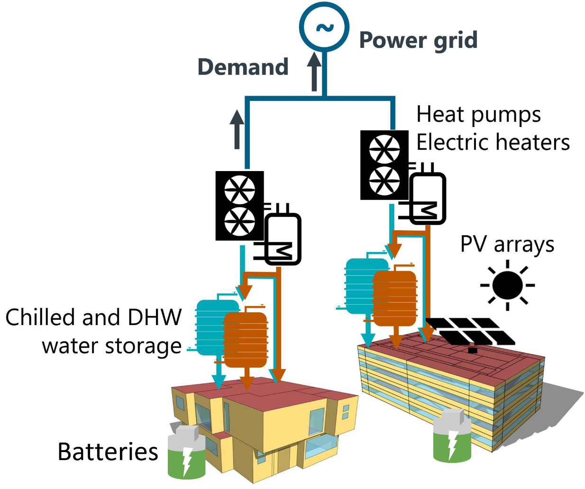

# CityLearn

CityLearn is an open source OpenAI Gym environment for the implementation of Multi-Agent Reinforcement Learning (RL) for building energy coordination and demand response in cities. Its objective is to facilitiate and standardize the evaluation of RL agents such that different algorithms can be easily compared with each other.


## Description
Districts and cities have periods of high demand for electricity, which raise electricity prices and the overall cost of the power distribution networks. Flattening, smoothening, and reducing the overall curve of electrical demand helps reduce operational and capital costs of electricity generation, transmission, and distribution networks. Demand response is the coordination of electricity consuming agents (i.e. buildings) in order to reshape the overall curve of electrical demand.



CityLearn allows the easy implementation of reinforcement learning agents in a multi-agent setting to reshape their aggregated curve of electrical demand by controlling the storage of energy by every agent. Currently, CityLearn allows controlling the storage of domestic hot water (DHW), chilled water (for sensible cooling and dehumidification) hot water (for sensible heating) and electricity. CityLearn also includes models of air-to-water heat pumps, electric heaters, solar photovoltaic arrays, and the pre-computed energy loads of the buildings, which include space cooling, dehumidification, appliances, DHW, and solar generation.

## Installation
Install with `pip`:
```console
pip install git+https://github.com/intelligent-environments-lab/CityLearn.git@citylearn_2022
```

## API Documentation
Refer to the [docs](https://intelligent-environments-lab.github.io/CityLearn/api/modules.html) for documentation of the CityLearn API.

## The CityLearn Challenge
- [CityLearn Challenge 2020](https://sites.google.com/view/citylearnchallenge/previous-edition-2020?authuser=0)
- [CityLearn Challenge 2021](https://sites.google.com/view/citylearnchallenge/home?authuser=0)
- [CityLearn Challenge 2022](https://www.aicrowd.com/challenges/neurips-2022-citylearn-challenge)
