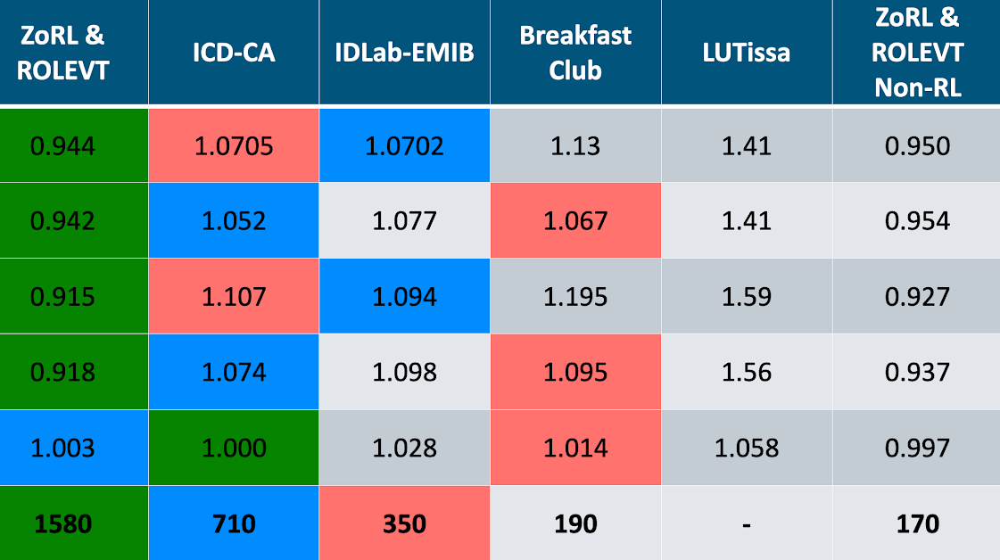

============================
The CityLearn Challenge 2021
============================

.. note::

    The CityLearn Challenge 2021 has now concluded! The winners and the leaderboard have been announced at the `RLEM Workshop 2021 <https://rlem-workshop.net/editions/2021/>`_.

.. note::

    The CityLearn Challenge 2021 :cite:p:`10.1145/3486611.3492226` used The CityLearn Challenge 2021 dataset :cite:p:`T8/Q2EIQC_2021` and `CityLearn v1.0.0 <https://github.com/intelligent-environments-lab/CityLearn/tree/v1.0.0>`_. To install this CityLearn version, run:

    .. code-block:: bash

        git clone -b v1.0.0 https://github.com/intelligent-environments-lab/CityLearn.git

Objective
*********

The increase of distributed energy storage systems (i.e. batteries, EVs, water heaters, e.t.c.) and of distributed energy generation resources (i.e. PV panels) constitutes an opportunity to better coordinate all these systems and achieve grid-interactive energy efficient connected buildings.

We introduce a multi-agent control challenge in which the participating teams must coordinate the energy consumed by each of the buildings within a simulated micro-grid. There are different objectives or evaluation metrics, which are described in the Scoring section.

Coordinate the buildings to minimize the cost metrics for the whole district by flattening and smoothing the overall annual curve of electricity consumption on an hourly basis.

The environment allows creating one agent for each building or controlling multiple buildings with the same agent. Agents can easily be programmed to act simultaneously, sequentially, greedily, or sharing information.

What does the simulation look like?
===================================

The agents must control the energy stored by a micro-grid of 9 buildings in real-time for a period of 4 simulated years, on an hourly time-scale. Each building has up to 3 action-variables (domestic hot water storage, chilled water storage, and electrical storage). This is a coordination challenge, so most of objectives of this control problem depend on the joint actions of all the buildings combined.

In contrast to other traditional reinforcement learning problems, where there are multiple episodes, the CityLearn Challenge only has one episode of 4 years. Your agents will need to explore and exploit the best control policy they can learn within those 4 years.

Your team should design the agents based on :file:`Climate Zone 5`, which contains the 4 years of data. Feel free to modify the building attributes that are located in the file :file:`data/Climate_Zone_5/building_attributes.json` if you want. This file will not be submitted, but modifying it could give you a better understanding of the robustness of your control agents with respect to the baseline RBC controller. When we evaluate your submission, we will modify the building attributes in the building_attributes.json file.

Submission
**********

First, you must have registered your team `here <https://docs.google.com/forms/d/1cOzwf2vSG8GL0klz9TjAq3hl7Q2fiu95Ili065zWLm4/edit>`_. All the teams must submit at least 3 files (4 files if you submit both a RL and a non-RL agent):

1. :file:`agent.py` and/or :file:`agent_non_rl.py`
2. :file:`reward_function.py`
3. :file:`buildings_state_action_space.json`

They all can be found in the folder `submission_files <https://github.com/intelligent-environments-lab/CityLearn/tree/v1.0.0/submission_files>`_. If you are submitting an agent that is not based on reinforcement learning, you can change the name of the file :file:`agent.py` to :file:`agent_non_rl.py` and submit it with the rest of your files. You can send both a :file:`agent.py` and a :file:`agent_non_rl.py` file.

How do we evaluate your submission?
===================================

To evaluate your submission we will add your files to the root directory of the `CityLearn repository <https://github.com/intelligent-environments-lab/CityLearn/tree/v1.0.0>`_ and run the file :file:`main.py` to get your scores. Therefore, you must make sure that your files will work properly when we run the :file:`main.py` file. 

If you submit the file :file:`agent_non_rl.py`, we will import it within the :file:`main.py`` file (adding the line "from agent_non_rl import Agent" at the beginning of the :file:`main.py` file). Just make sure your class :class:`Agent`` will run properly when we import it.

We will run the agents on a different set of 9 buildings than the one we provide in the Github repository, so make sure your agent can adapt to new environments and does not over-fit the one we provide.

Deadline & Where to Submit
==========================

We will be accepting submissions  until **August 8th, 11.59pm AoE**. To submit, compress your submission files as a `.zip` file with the name of your team: :file:`your_team_name.zip`, and `submit to the Box folder <https://utexas.app.box.com/f/8f782f418a7c4754b9b563c3394ea863>`_.

Rules
*****

1. The agents submitted must be based on reinforcement learning, unless your team specifically submits a non-RL agent to the non-RL category.
2. Mixed control approaches that are based on RL, but that combine RL with some other type of controller (such as MPC, rule-based controller, etc), are valid and can be submitted as RL agents instead of as non-RL agents.
3. None of the agents you submit, or any of the classes in your files, is allowed to directly read the files that are in the directory "data"
4. The submission of pre-trained RL agents is not allowed.
5. Your agent must take less than 10 hours to run in a free Google Colab notebook, using GPU acceleration, or a comparable MS Azure notebook.
6. The main file must be used as it is provided. This may make the use of RL libraries and packages more difficult, but will give you more flexibility to implement decentralized RL agents that can potentially share information with each other.
7. In order to receive a prize, your team must give us permission to make its solution to the challenge publicly available, and provide a list of all the authors for reference.
8. Any teams from The University of Texas at Austin, the University of Colorado Boulder, NREL, or Onboard Data cannot receive prize money or appear on the main leader board to avoid conflict of interest with the organizers. However, they can still submit their solutions and score, in which case we may create a separate table that shows their scores.

Scoring
*******

.. csv-table::
   :file: ../../../assets/tables/citylearn_challenge_2021_scoring.csv
   :header-rows: 1

The submission of every team will be evaluated on each of the 5 objectives on the table above. The submissions will be ranked for each of the 5 objectives, and the points will be assigned to each team based on their rank (1st, 2nd or 3rd). Any team can collect the points from several categories. i.e. if a team's submission is 1st on objective 1 "Total", and 2nd on objective 5 "Carbon Emissions", the team will receive 440 + 110 pts.

There is a special category, "Non-RL", reserved for any teams that want to submit a control agent that is not based on Reinforcement Learning. The submissions in this category will be independent from the rest of the categories and will have their own ranking. Teams that submit a RL agent, are also allowed to submit a non-RL agent. It is possible to obtain points from both non-RL and RL categories (i.e. a team could be 1st on both a RL and a non-RL objective and receive points from both). If we do not receive any submissions for the non-RL category, we will add its points to each of the rows, 1 through 4, in the column "1st (RL)".

Metrics
=======
When you run a simulation in :file:`CityLearn v1.0.0`, it will return a set of metrics and scores once the simulation is over:

1. :code:`ramping`: the net non-negative electricity consumption every time-step.
2. :code:`1-load_factor`: the load factor is the average net electricity load divided by the maximum electricity load.
3. :code:`average_daily_peak`: average daily peak net demand.
4. :code:`peak_demand`: maximum peak electricity demand
5. :code:`net_electricity_consumption`: total amount of electricity consumed.
6. :code:`carbon_emissions`: total amount of carbon emissions.

Where with respect to the scoring table;

- **Total** - Average of the metrics 1, 2, 3, 4, 5, and 6 for the full simulated period (4 years)
- **Total Last Year** - Average of the metrics 1, 2, 3, 4, 5, and 6 for the last year of the simulation
- **Coordination Score** - Average of the metrics 1, 2, 3, and 4 for the full simulated period (4 years)
- **Coordination Score Last Year** - Average of the metrics 1, 2, 3, and 4 for the last year of the simulation.
- **Carbon Emissions** - Metric 6

Winner
******
We will rank all the teams on a leader board based on the total number of points received. The team with the highest number of points wins.

Prizes
******

Each team will receive a cash prize following the conversion 1 point = 1 USD.

Leaderboard
***********

Sponsors
********

.. image:: ../../../assets/images/onboard_logo.png
   :alt: OnBoard logo
   :target: https://www.onboarddata.io
   :width: 16%

.. image:: ../../../assets/images/ut_energy_institute_logo.png
   :alt: Energy Institute, The University of Texas at Austin logo
   :target: https://energy.utexas.edu
   :width: 30%

.. image:: ../../../assets/images/cub_rasei_logo.jpg
   :alt: Renewable and Sustainable Energy Institute, University of Colorado Boulder logo
   :target: https://www.colorado.edu/rasei/
   :width: 20%