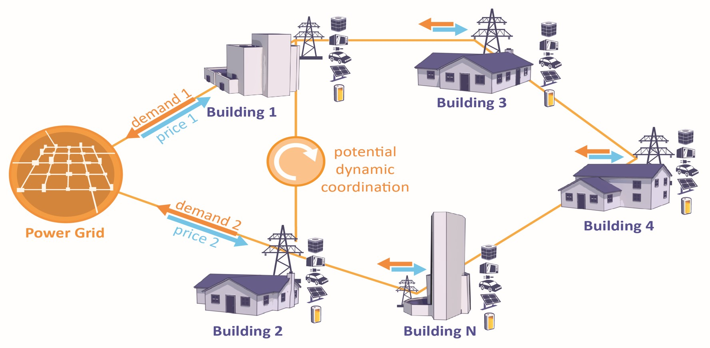

=========
CityLearn
=========

.. panels::
   :column: col-lg-12 p-2

   This output is listed in the `Digital Public Goods Alliance Registry <https://digitalpublicgoods.net/registry/>`_ and contributes to the following UN `Sustainable Development Goals (SDGs) <https://sdgs.un.org/goals>`_:

   .. image:: ../../assets/images/un_sdg_7.png
      :alt: United Nations Sustainable Development Goal 7: Affordable and Clean Energy
      :scale: 8 %
      :target: https://sdgs.un.org/goals/goal7

   .. image:: ../../assets/images/un_sdg_11.png
      :alt: United Nations Sustainable Development Goal 11: Sustainable Cities and Communities
      :scale: 8 %
      :target: https://sdgs.un.org/goals/goal11
      
   .. image:: ../../assets/images/un_sdg_13.png
      :alt: United Nations Sustainable Development Goal 13: Climate Action
      :scale: 8 %
      :target: https://sdgs.un.org/goals/goal13

CityLearn is an open source OpenAI Gym environment for the implementation of Multi-Agent Reinforcement Learning (RL) for building energy coordination and demand response in cities :cite:p:`https://doi.org/10.48550/arxiv.2012.10504, 10.1145/3360322.3360998`. A major challenge for RL in demand response is the ability to compare algorithm performance :cite:p:`VAZQUEZCANTELI20191072`. Thus, CityLearn facilitates and standardizes the evaluation of RL agents such that different algorithms can be easily compared with each other.

Districts and cities have periods of high demand for electricity, which raise electricity prices and the overall cost of the power distribution networks. Flattening, smoothening, and reducing the overall curve of electrical demand helps reduce operational and capital costs of electricity generation, transmission, and distribution networks. CityLearn allows the easy implementation of reinforcement learning agents in a single or multi-agent setting to reshape their aggregated curve of electrical demand by controlling active energy storage for load shifting and heat pump or electric heater power for load shedding.

Applications
************

CityLearn has been utilized in the following projects and publications:

.. csv-table::
   :file: ../../assets/tables/citylearn_applications.csv
   :header-rows: 1

.. toctree::
   :hidden:
   
   installation
   quickstart
   overview/index
   usage/index
   api/modules
   citylearn_challenge/index
   contributing
   references

Cite CityLearn
**************

.. code-block:: bibtex

   @inproceedings{10.1145/3360322.3360998,
      author = {V\'{a}zquez-Canteli, Jos\'{e} R. and K\"{a}mpf, J\'{e}r\^{o}me and Henze, Gregor and Nagy, Zoltan},
      title = {CityLearn v1.0: An OpenAI Gym Environment for Demand Response with Deep Reinforcement Learning},
      year = {2019},
      isbn = {9781450370059},
      publisher = {Association for Computing Machinery},
      address = {New York, NY, USA},
      url = {https://doi.org/10.1145/3360322.3360998},
      doi = {10.1145/3360322.3360998},
      booktitle = {Proceedings of the 6th ACM International Conference on Systems for Energy-Efficient Buildings, Cities, and Transportation},
      pages = {356–357},
      numpages = {2},
      keywords = {Smart Grid, Building Energy Control, Smart Buildings},
      location = {New York, NY, USA},
      series = {BuildSys '19}
   }

Indices and tables
******************

* :ref:`genindex`
* :ref:`modindex`
* :ref:`search`