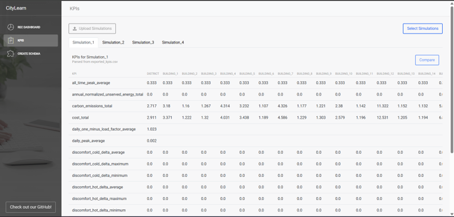
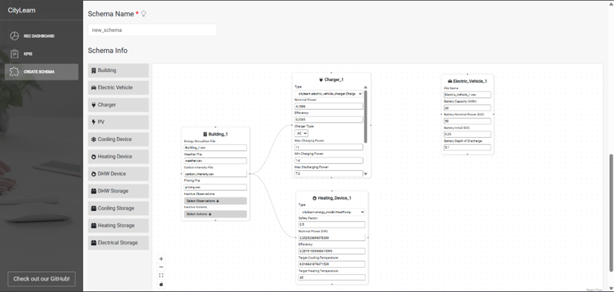

===========
CityLearn UI
===========

CityLearn UI is a visual dashboard for exploring simulation data generated by the CityLearn framework. It was developed to simplify the analysis of results from smart energy communities, district energy coordination, demand response (among other applications), allowing users to visually inspect building-level components, compare simulation KPIs, and create simulation schemas with ease.

The interface is available in two options:

* Web app: https://citylearnui.netlify.app/ (free hosted version — not recommended for sensitive/personal data)
* Open-source code: https://github.com/Soft-CPS-Research-Group/citylearn-ui

You can check a tutorial at the official CityLearn `website <https://intelligent-environments-lab.github.io/CityLearn/ui.html>`_, in the CityLearn UI repository `README <https://github.com/Soft-CPS-Research-Group/citylearn-ui>`_, or at the help `tooltip of the official webapp <https://citylearnui.netlify.app/admin/help>`_.

**Compatibility:** This version of the UI currently supports CityLearn v2.4.3 simulation data.

**Developed by:** José, a member of the `SoftCPS <https://www2.isep.ipp.pt/softcps/>`_, Software for Cyber-Physical Systems research group (ISEP, Portugal) in collaboration with the Intelligent Environments Lab, University of Texas at Austin.

Exporting Data From CityLearn into CityLearn UI
===============================================

CityLearn automatically exports the folder structure expected by the UI. There are three workflows to consider:

* ``render=False`` (default): no CSVs are produced, so the UI cannot ingest data.
* ``render=True``: data is exported every simulation step into timestamped folders. You may keep the default location (``<project>/render_logs/<timestamp>``) or set ``render_directory``/``render_directory_name`` on :class:`citylearn.citylearn.CityLearnEnv` to choose the destination.
* ``render=False`` with explicit export: keep rendering off for faster runs and call :meth:`citylearn.citylearn.CityLearnEnv.export_final_kpis` (or a custom exporter) at the end. This lazily creates the render folder and writes the same CSV layout required by the UI.

Render-on Example
-----------------

.. code-block:: python

    from pathlib import Path
    from citylearn.citylearn import CityLearnEnv

    schema = 'data/datasets/citylearn_challenge_2022_phase_all_plus_evs/schema.json'

    env = CityLearnEnv(
        schema,
        central_agent=True,
        episode_time_steps=48,
        render=True,
        render_directory=Path('outputs/ui_exports'),  # optional custom base folder
    )

    observations, _ = env.reset()
    while not env.terminated:
        actions = [env.action_space[0].sample()]
        observations, reward, terminated, truncated, info = env.step(actions)

The code above writes per-step CSV files into ``outputs/ui_exports/<timestamp>/``. Omitting ``render_directory`` stores the results in ``render_logs/<timestamp>/`` by default.

Export-at-the-End Example
-------------------------

.. code-block:: python

    from citylearn.citylearn import CityLearnEnv

    env = CityLearnEnv(schema, central_agent=True, episode_time_steps=48, render=False)
    observations, _ = env.reset()
    while not env.terminated:
        actions = [env.action_space[0].sample()]
        observations, reward, terminated, truncated, info = env.step(actions)

    class _Model:
        pass

    model = _Model()
    model.env = env

    env.export_final_kpis(model, filepath='exported_kpis.csv')
    print('Render folder:', env.new_folder_path)

This pattern keeps rendering off (fastest) and emits the UI-compatible folder once the run completes. The helper reuses the same rules for ``render_directory``/``render_directory_name`` if they were provided during construction.

The UI consumes the directory produced by either of the latter two approaches. The system uses the :meth:`~citylearn.citylearn.CityLearnEnv.render` method to iterate over buildings, electric vehicles, batteries, chargers, pricing, etc., using their ``as_dict`` outputs to build CSV histories where each row corresponds to a time instant and columns include units. Timestamps are converted to calendar dates for display. You can disable step-wise exporting by keeping ``render=False`` and relying on the end-of-run exporter.

Pages within CityLearn UI
=========================

CityLearn UI has three main pages, described below. All referenced images should be placed under ``docs/source/_static/ui/`` with the indicated filenames.

Dashboard Overview
------------------

This landing page lets you upload and explore simulations.

Uploading Simulations
^^^^^^^^^^^^^^^^^^^^^

* Prepare a folder named ``SimulationData``.
* Inside, add subfolders per simulation.
* Each simulation folder must contain CSVs named as follows:
  * **Buildings:** ``exported_data_building_X`` (where ``X`` is the building number)
  * **Components:** append suffixes such as ``_battery`` or ``_charger_X_Y``
  * **Episodes:** end filenames with ``_epZ`` (episode number ``Z``)

Structure example: ``SimulationData/MySim/exported_data_building_1_battery_ep3.csv``.

Selecting Simulations
^^^^^^^^^^^^^^^^^^^^^

After uploading a valid folder, click **Select Simulations** to choose which runs to visualize. At least one simulation must be selected before confirming.

.. image:: _static/ui/selecting-simulations.png
   :align: center
   :alt: Selecting simulations

Viewing Simulation Data
^^^^^^^^^^^^^^^^^^^^^^^

Each chosen simulation appears as a tab. Within a tab:

* The left sidebar lists buildings and their grouped components (Consumption, Production, Other Equipment).
* Selecting a component displays its chart on the right.

This layout enables quick navigation across building-level data.

.. image:: _static/ui/simulation-data.png
   :align: center
   :alt: Simulation data view

Graphs and Filters
^^^^^^^^^^^^^^^^^^

Graphs support multiple filtering controls:

* Adjust time-step intervals (highlighted in red),
* Toggle data series via checkboxes (green),
* Restrict start/end dates using the slider (blue).

KPIs Page Overview
------------------

The KPIs page allows uploading folders and selecting simulations for KPI analysis. Once a simulation is active, its KPIs appear in a table (rows = KPIs, columns = buildings).

Comparing Simulations
^^^^^^^^^^^^^^^^^^^^^

When multiple simulations are loaded, a **Compare** button lets you choose a reference run. The comparison tab shows ``Simulation Y – Simulation X`` deltas.

* Positive values (improvements) appear in **bold green**.
* Negative values (declines) appear in **bold red**.
* Zero differences remain black.

.. image:: _static/ui/kpis-comparison.png
   :align: center
   :alt: KPI comparison view

Create Schema Overview
----------------------

The Create Schema page guides dataset assembly via three sections.

Step 1: Dataset Information
^^^^^^^^^^^^^^^^^^^^^^^^^^^

Displays dataset metadata, period settings, selected observations, and actions.

.. image:: _static/ui/dataset-info.png
   :align: center
   :alt: Dataset information

Step 2: Agent & Reward Configuration
^^^^^^^^^^^^^^^^^^^^^^^^^^^^^^^^^^^^

Define agent details, reward functions, and upload JSON configuration files. Uploaded files can be previewed and edited inline.

.. image:: _static/ui/agent-reward-config.png
   :align: center
   :alt: Agent and reward configuration

Step 3: Schema Structure (Canvas)
^^^^^^^^^^^^^^^^^^^^^^^^^^^^^^^^^

Provides a drag-and-drop canvas for constructing schemas:

* The left panel lists components to add (buildings, equipment, etc.).
* Drag components onto the canvas and fill in required fields.
* Link equipment to buildings, rename items, and copy/paste repeating elements.

This interface streamlines the creation and management of complex simulation schemas.

UI updates and improvements are ongoing. Feedback and contributions are welcome via the `CityLearn UI repo <https://github.com/Soft-CPS-Research-Group/citylearn-ui>`_

Contributors: José Oliveira and Tiago Fonseca (calof@isep.ipp.pt)
